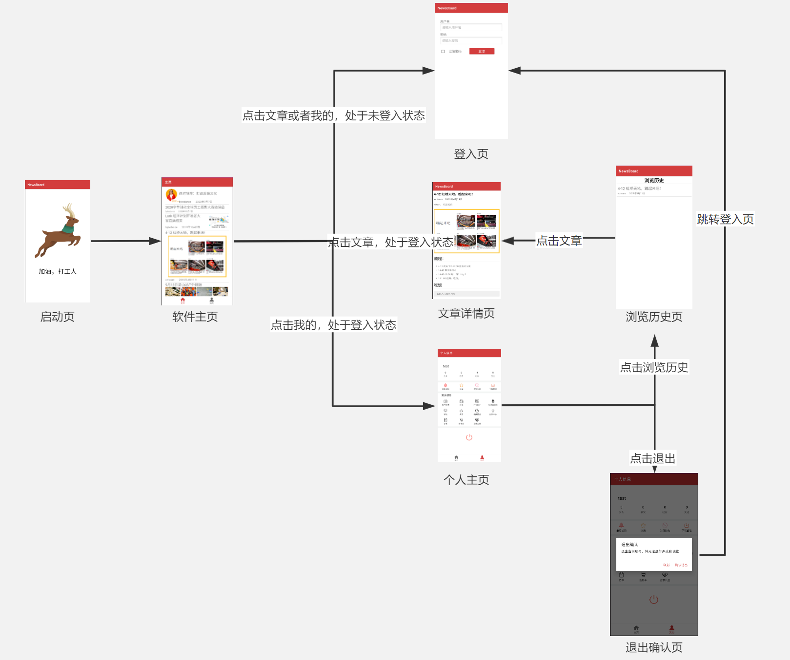
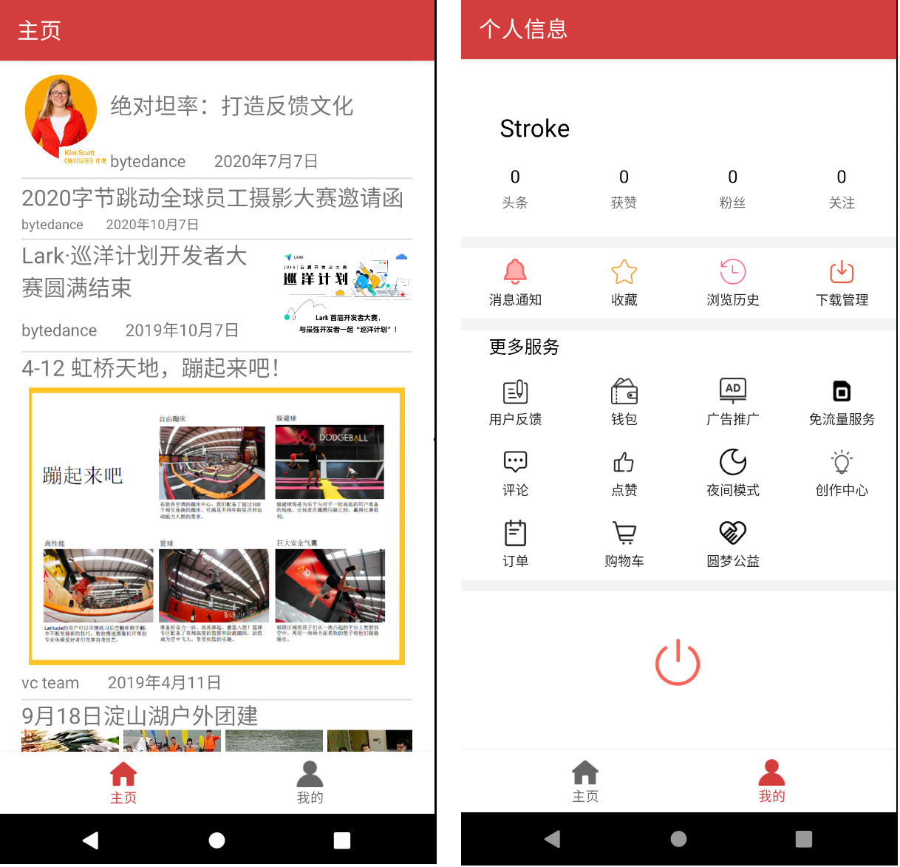
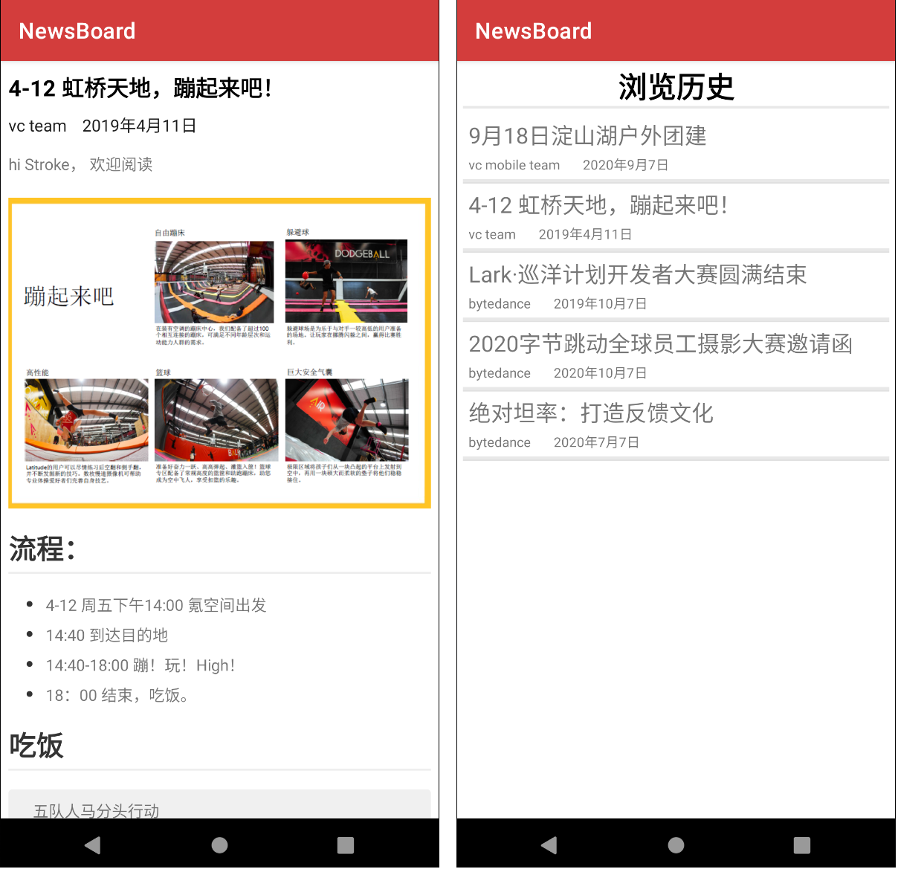
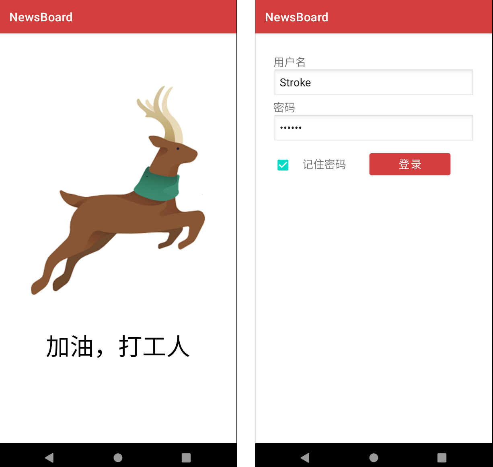

[![Platform][1]][2] [![GitHub license][3]][4]

[1]:https://img.shields.io/badge/platform-Android-blue.svg
[2]:https://github.com/StrokeBun/NewsBoard
[3]:https://img.shields.io/badge/license-MIT-blue.svg
[4]:https://github.com/StrokeBun/NewsBoard/blob/master/LICENSE

## NewsBoard

本项目是字节跳动飞书音视频客户端训练营第16组的提交作业，开发者为 [StrokeBun(钟德锋)](https://github.com/StrokeBun) 与 [Arctic2333(苏淞丰)](https://github.com/Arctic2333).

NewsBoard 是一个信息公告板app，没有广告，给予用户最纯粹的阅读体验，正在完善中.

## Features

- 实现首页的布局和数据显示
- 实现富文本排版
- 实现个人用户界面，提供导航栏
- 本地记录用户的浏览历史
- app启动动画
- 网络较差时进行加载提示

## Structure



## Screenshots

 





## Code Structure

``` 
com
└── example
    └── newsboard
        ├── base 基础组件
        ├── model 模型数据
        ├── ui 用户界面
            ├── activity 活动类
            ├── adapter 适配器
            ├── fragement 碎片类
        ├── util 工具类
```

## Libraries

- [Android Support Libraries](https://developer.android.google.cn/index.html)
- [RichText](https://github.com/zzhoujay/RichText)
- [Glide](https://github.com/bumptech/glide)
- [矢量图标](https://www.iconfont.cn/)

## End

注意：此开源项目仅做学习交流使用, 不可用于任何商业用途. 如果你觉得不错或者对你有帮助, 欢迎点个 star.

## License

```
MIT License

Copyright (c) 2020 StrokeBun and Arctic2333

Permission is hereby granted, free of charge, to any person obtaining a copy
of this software and associated documentation files (the "Software"), to deal
in the Software without restriction, including without limitation the rights
to use, copy, modify, merge, publish, distribute, sublicense, and/or sell
copies of the Software, and to permit persons to whom the Software is
furnished to do so, subject to the following conditions:

The above copyright notice and this permission notice shall be included in all
copies or substantial portions of the Software.

THE SOFTWARE IS PROVIDED "AS IS", WITHOUT WARRANTY OF ANY KIND, EXPRESS OR
IMPLIED, INCLUDING BUT NOT LIMITED TO THE WARRANTIES OF MERCHANTABILITY,
FITNESS FOR A PARTICULAR PURPOSE AND NONINFRINGEMENT. IN NO EVENT SHALL THE
AUTHORS OR COPYRIGHT HOLDERS BE LIABLE FOR ANY CLAIM, DAMAGES OR OTHER
LIABILITY, WHETHER IN AN ACTION OF CONTRACT, TORT OR OTHERWISE, ARISING FROM,
OUT OF OR IN CONNECTION WITH THE SOFTWARE OR THE USE OR OTHER DEALINGS IN THE
SOFTWARE.
```

